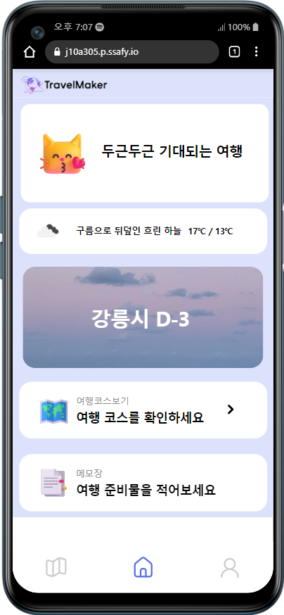

## 목차

1. [팀원소개](#팀원소개)
2. [프로젝트 소개](#프로젝트 소개)
3. [기능명세서](#기능명세서)

# 팀원소개

팀장: 박지원(FE)
팀원: 김연화(FE) 이건희(FE/BE/Infra) 이진규(BE/Infra) 전성재(BE/BigData) 최영진(BE/BigData)

# 프로젝트 소개
**사용자 맞춤형 여행 코스 제공 및 기록 서비스**

# 기능명세서

### 1. 로그인
- 카카오 소셜 로그인

### 2. 메인 페이지
- 코스 전 (Before Course)

 랜덤 추천 명소에 좋아요를 누르면 빅데이터 추천 기능에 활용 

- 코스 후 (After Course)

여행 준비를 위한 메모 기능 

- 여행 중 (On Course)

오늘의 코스를 슬라이드로 확인 가능 

### 3. 코스

- 날짜, 교통수단 선택

여행이 짜여진 날짜는 선택 불가능, 교통수단에 따라 추후추정시간 변화

- 친구 검색

그룹생성 후 친구의 취향도 고려한 코스추천 가능

- 도 선택

- 시 선택

사용자가 메인페이지에서 좋아요를 많이 누른 시를 추천

- 추천받은 목록 선택

혼자 혹은 친구의 취향을 고려한 장소들 추천리스트

- 코스 상세페이지

고른 장소들을 최적 경로로 만들어서 추천

- 코스 편집페이지

 직접 편집도 가능

### 4. 마이페이지

일정, 일기 탭으로 구분

### 5. 일기페이지

