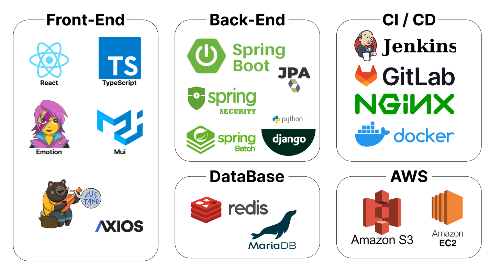

# 목차

1. [팀원소개](#팀원소개)
2. [프로젝트 소개](#프로젝트-소개)
3. [개발환경&아키텍처](#개발환경-및-아키텍처)
4. [기능명세서](#기능명세서)
5. [핵심기술](#핵심기술)
6. [ERD](#erd)

# 🏃팀원소개

|박지원|김연화|이건희|이진규|전성재|최영진|
|:---:|:---:|:---:|:---:|:---:|:---:|
|||||||
|팀장, Frontend,  코스설정, 코스편집|Frontend,  메인페이지 세분화|Infra, Backend,  Frontend, 소셜 로그인|Backend, Infra,  군집화, 최단경로 알고리즘|Backend, BigData,  스케쥴링, 데이터 정제|Backend, BigData,  빅데이터 추천|

# 📜프로젝트 소개
### TravelMaker 는 사용자 맞춤형 여행 코스 제공 및 기록 서비스입니다.
 

## 1. 프로젝트 개요

### 개발 기간
2024-02-26 ~ 2024-04-05 (6주)

### 서비스 목표
① 언제 갈지만 정하면 여행 일정을 만들어주는 서비스
 
② 나와 친구의 관심사를 반영한 여행 코스를 만들어주는 서비스
 
③ 효율적인 여행 동선을 제공해주는 서비스

### 🏆수상내역
|삼성 청년 소프트웨어 특화 프로젝트 본선 우수상|
|---|
 

# ✨개발환경 및 아키텍처

|개발환경|아키텍처|
|---|---|
|||

 

# 🎨기능명세서

| 로그인 | 메인 페이지 | 메인 페이지 |
| :-----------------: | :-----------------: | :-----------------:| 
| **카카오 소셜 로그인** | **1. 코스 전 (Before Course)** | **2. 코스 후 (After Course)** | 
| |랜덤 추천 명소에 좋아요를 누르면   빅데이터 추천 기능에 활용 | 여행 준비를 위한 메모 기능 | 
|  |  |  | 

| 메인 페이지 | 코스 |  코스 | 
|:-----------------:|:-----------------:|:-----------------:|
| **3. 여행 중 (On Course)** | **날짜, 교통수단 선택** | **친구 검색** |
| 오늘의 코스를 슬라이드로 확인 가능 | 여행이 짜여진 날짜는 선택 불가능,   교통수단에 따라 추후추정시간 변화 | 그룹생성 후   친구의 취향도 고려한 코스추천 가능 |
|  |  |  |

| 코스 | 코스 | 코스 |
|:-----------------:|:-----------------:|:-----------------:|
| **도 선택** | **시 선택** | **추천받은 목록 선택** |
| | 사용자가 메인페이지에서   좋아요를 많이 누른 시를 추천| 혼자 혹은 친구의 취향을 고려한   장소들 추천리스트 |
|  |  |  |

| 코스 | 코스 | 마이페이지 |
|:-----------------:|:-----------------:|:-----------------:|
| **코스 상세페이지** | **코스 편집페이지** | **마이페이지** |
| 고른 장소들을 최적 경로로 만들어서 추천 | 직접 편집도 가능 | 일정, 일기 탭으로 구분 |
|  |   | |

| 일기페이지 |
|:-----------------:|
|  |

 

# 💎핵심기술
## 1. 데이터 정제
|1차 데이터 정제|2차 데이터 정제|
|:---|:---|
|한국관광공사에서 제공하는 Api의 Data들이 파편화 &nbsp; -> 하나의 데이터로 만들 필요성을 느낌  **104,875개**의 장소를 **하나의 데이터셋**으로 만드는 함수를 구현하여 정제|데이터셋을 **추천 알고리즘에 사용하기 적합하게 각 장소의 특징들을 정제**하고, 서비스에 적합한 특징들을 추가로 저장하여 정제|

## 2. 하이브리드 빅데이터 추천 시스템 - 컨텐츠 기반 필터링(CBF) + 협업 필터링(CF)
**하이브리드 방식을 사용한 이유**
- CF의 경우 사용자에 대한 데이터가 쌓이기 전까지는 cold-start의 위험성이 존재
- 초반에는 상대적으로 cold-start 문제가 적은 CBF를, 어느정도 데이터가 쌓인 후에는 CF를 사용하는 방식으로 하이브리드 추천 시스템을 구축

**TF-IDF 활용**
- 장소에 대한 특징을 분석하기 위해 키워드 분석에 특화된 TF-IDF을 활용
- 장소 데이터가 '해안, 자연, 절경'처럼 단어의 나열로 구성되어 있었기 때문에, 빈도와 역 문서 빈도를 사용하여 단어들마다 중요한 정도에 따라서 가중치를 부여하는 방법인 TF-IDF을 적용

**추천 속도 최적화**
- **Foreign Key 관계 삭제**와 **조회 쿼리 최적화**를 진행하여 속도를 14초에서 0.65초로 **10초 이상 단축**

## 3. 군집화와 최적 경로 알고리즘
- 사용자가 선택한 장소를 바탕으로 여행 일자를 분할해주기 위해서 군집화에 주로 사용되는 **K-means++** 알고리즘을 프로젝트에 적용하여 사용자에게 자동적으로 여행 일자를 나누고 최적 경로를 제공해주는 편의성을 제공해주었습니다.

**K-Means++ Algorithm이란?**
- 데이터를 여러 그룹으로 분할하여 유사한 패턴을 찾아내는 클러스터링 알고리즘
- 데이터 포인트들을 중심점과의 거리에 따라 그룹화하여 군집을 형성**

**최적 경로 알고리즘**
경로를 탐색하는 다양한 알고리즘(다익스트라, 플로이드-워셜)이 있지만 ① 출발지&도착지 모호 ②
경로추적 용이 ③최단 거리 보장의 특성을 생각하여 완전탐색(DFS) 알고리즘을 채택하여 적용  

 

# 💾ERD

